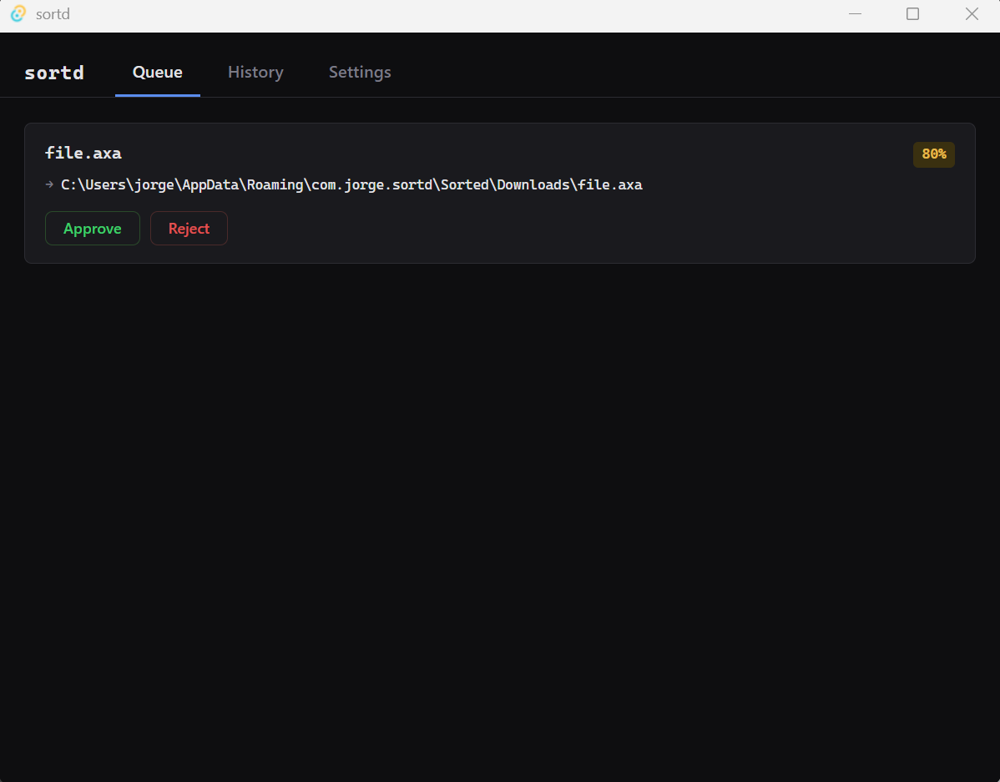
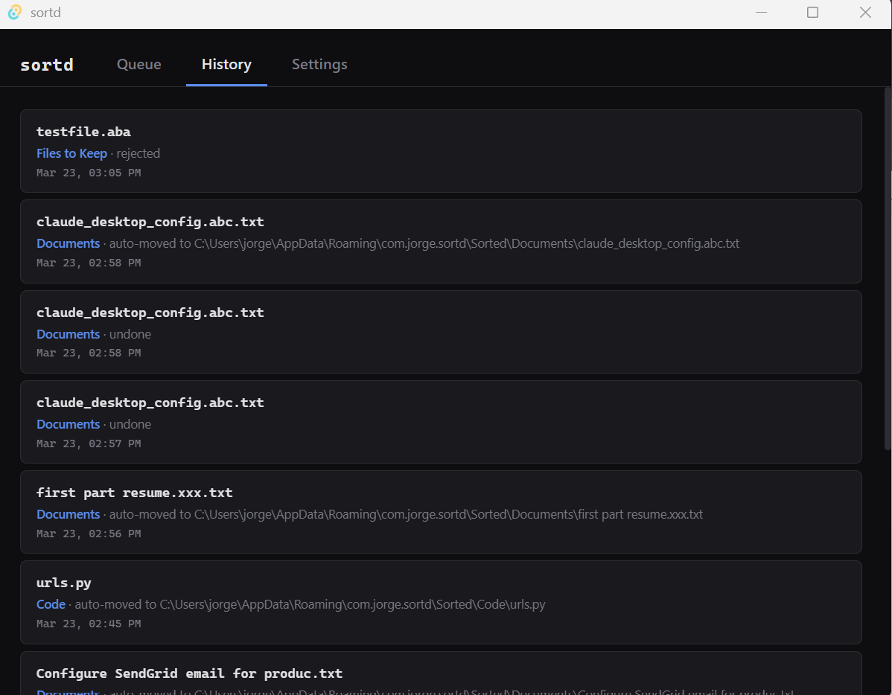
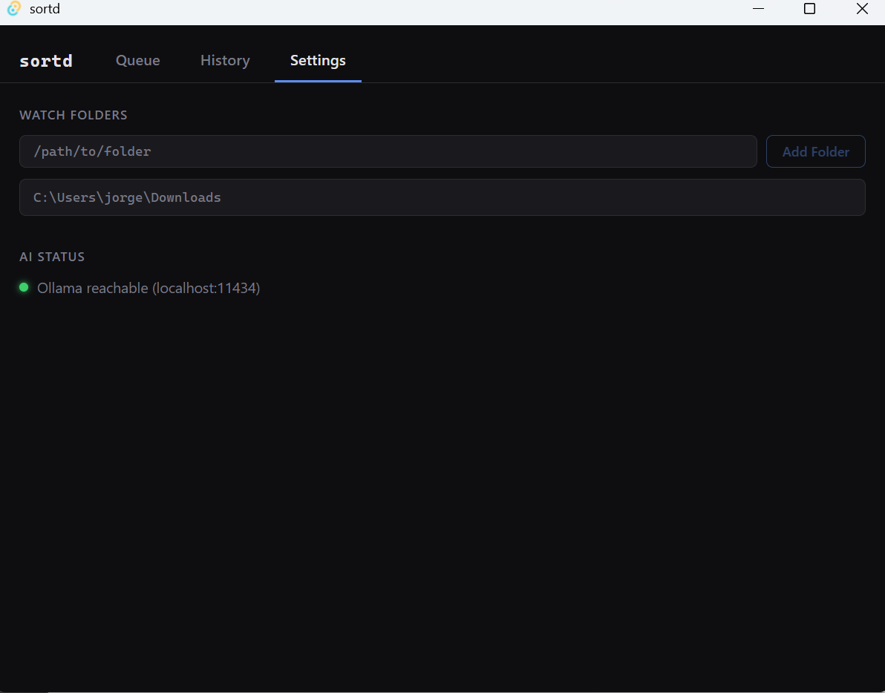

# Sortd

**Local-first AI file organization agent — your folders, your model, your machine.**


---

## What it does

Sortd watches any folders you choose and automatically classifies every new file using a local AI model running on your own hardware via [Ollama](https://ollama.ai). Files with high-confidence classifications are moved instantly and silently; lower-confidence files land in a staging queue where you approve, reject, or redirect them with a single click. Every decision you make teaches Sortd's rule engine so future classifications get smarter over time. Nothing ever leaves your machine — no cloud API, no telemetry, no accounts.

---

## Screenshots

| Queue | History | Settings |
|-------|---------|----------|
|  |  |  |

---

## Confidence system

| Confidence | Action |
|-----------|--------|
| **> 90 %** | File is moved automatically and logged to History |
| **70 – 90 %** | File is added to the staging Queue for your approval |
| **< 70 %** | File is added to the Queue with a red low-confidence badge |

When you reject a staged file you can optionally supply the correct destination folder. Sortd records this as a rule and applies it to future files with the same extension.

---

## Tech stack

| Layer | Technology |
|-------|-----------|
| Desktop shell | [Tauri 2](https://tauri.app) |
| Backend logic | Rust |
| UI | React + TypeScript (Vite) |
| AI inference | [Ollama](https://ollama.ai) HTTP API |
| Language model | llama3.2 |
| Database | SQLite via `rusqlite` |
| Native dialogs | [`rfd`](https://crates.io/crates/rfd) |

---

## Prerequisites

- **Rust** 1.75 or later — [rustup.rs](https://rustup.rs)
- **Node.js** 18 or later — [nodejs.org](https://nodejs.org)
- **Ollama** — [ollama.ai](https://ollama.ai)
- **llama3.2** model pulled locally:
  ```bash
  ollama pull llama3.2
  ```

---

## Getting started

```bash
git clone https://github.com/mussussu/sortd
cd sortd
npm install
npm run tauri dev
```

The app window opens. Go to the **Settings** tab, add a folder to watch, and drop a file into it to see the agent loop in action.

---

## Building for production

```bash
npm run tauri build
```

The installer is written to `src-tauri/target/release/bundle/`.

---

## Project structure

```
sortd/
├── src/                        # React frontend
│   ├── App.tsx                 # Root component — tabs, history state
│   └── App.css                 # Dark-theme styles
└── src-tauri/
    ├── Cargo.toml
    └── src/
        ├── main.rs             # Tauri entry point
        ├── lib.rs              # Tauri commands + agent loop
        ├── db.rs               # SQLite schema and queries
        ├── watcher.rs          # notify-based filesystem watcher
        └── classifier.rs       # Extension classifier + Ollama AI client
```

---

## Roadmap

- [ ] System tray icon with quick-approve notifications
- [ ] Vision model support for image content classification
- [ ] Linux and macOS builds
- [ ] Custom rules editor UI
- [ ] MCP server integration

---

## Contributing

Pull requests are welcome. For large changes please open an issue first to discuss what you'd like to change.

1. Fork the repo
2. Create a feature branch (`git checkout -b feat/my-feature`)
3. Commit your changes (`git commit -m 'feat: add my feature'`)
4. Push to the branch (`git push origin feat/my-feature`)
5. Open a pull request

---

## License

[MIT](LICENSE) © Jorge 2026
